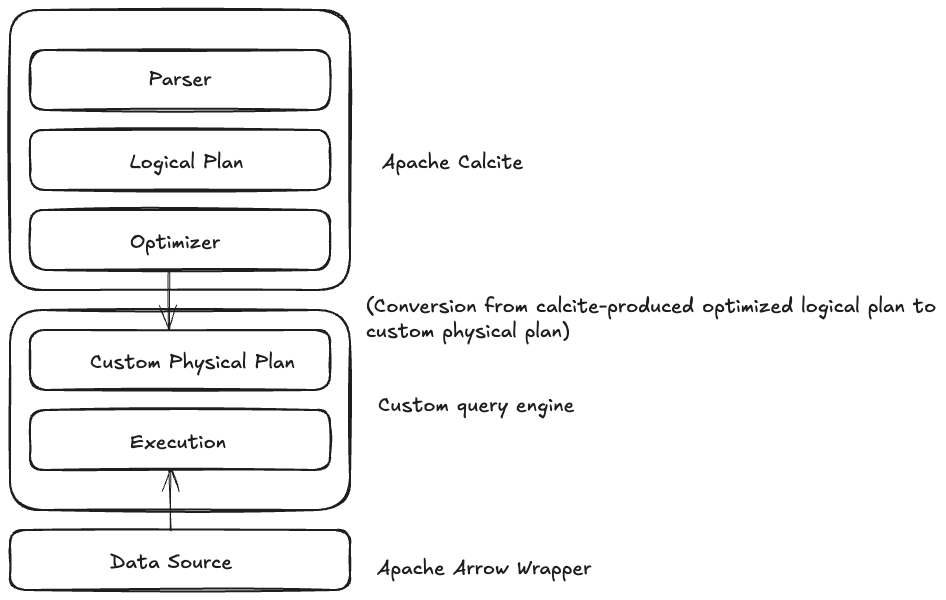

# TrivialDB: Single-node OLAP solution.

## Introduction:
Often you come across datasets that don't require a massive Spark cluster (which comes with the overhead of managing a distributed system). Wouldn't it be great to be able to process these datasets using the same DataFrame API you are familiar with on a single node? Introducing TrivialDB (based on Apache Calcite and Apache Arrow) to replace expensive Spark clusters

## Design:



## Usage:

1. Printing logical query plan (custom logical plan)
```java
        DataFrame df = ctx.inMemory()
                .project(Arrays.asList(
                        col("id"),
                        col("first_name"),
                        col("last_name"),
                        col("salary"),
                        col("salary")))
                .filter(col("id").gt(litLong(0L)));
        // System.out.println(df.logicalPlan().pretty());
        /**Prints out the following:
         * 	Projection: #id, #first_name, #last_name, #salary, #salary
         * 		Selection: #state = 'CO'
         * 			Scan: ; projection=None
         */
```

2. Running queries
```java
        DataFrame df = ctx.inMemory()
                .filter(new Eq(new Column("id"), new LiteralInt(1)));
        Iterable<RecordBatch> results = ctx.execute(df.logicalPlan());
```

## Road map:
1. Testing integration with Apache calcite and removing custom logical plan classes
2. Benchmarking TrivialDB's query engine against custom CSV/Parquet file processing
3. Adding support for aggregations and joins
4. Adding a network layer to run SQL queries against
5. Add support for distributed query plans and expand the query engine to be distributed
